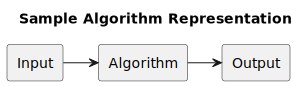

# Algorithms Knowledge Base

This is a collection of useful information and notes about algorithms. It's a personal knowledge base.

## Introduction

An *algorithm* is any well-defined sequence of steps that solves a problem. In the
context of computer science, an algorithm is any well-defined computational
procedure that takes some value, or set of values, as *input* and produces some
value, or set of values, as *output*.

   Algorithm -> Output" width="400px">

An algorithm is said to be *correct* if, for every problem instance provided
as an input, it *halts* – finishes its computing in a finite amount of time –
and outputs a correct solution to the problem instance.

*"Sometimes incorrect algorithms can be useful, if we can control their
error rate."*

## Bibliography

- [Introduction to Algorithms](https://mitpress.mit.edu/books/introduction-algorithms-fourth-edition) by Thomas H. Cormen, Charles E. Leiserson, Ronald L. Rivest, Clifford Stein.
